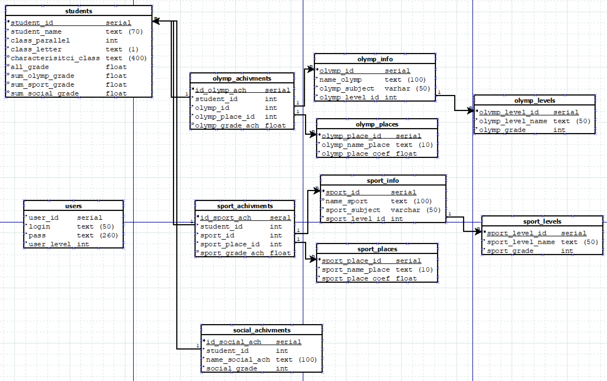
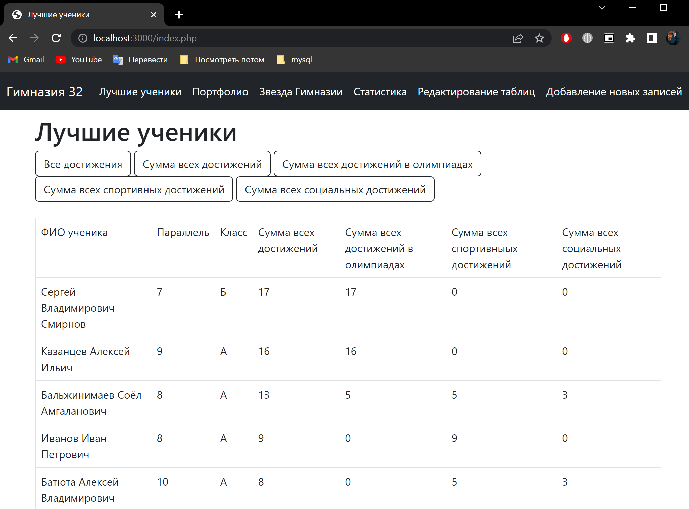
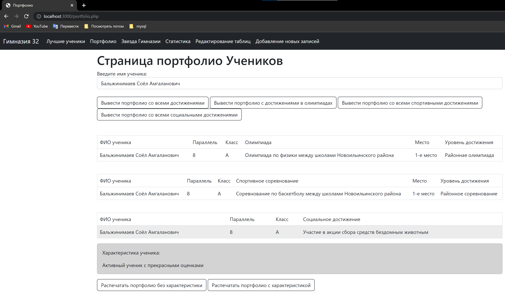
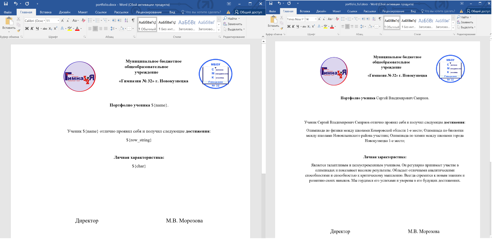
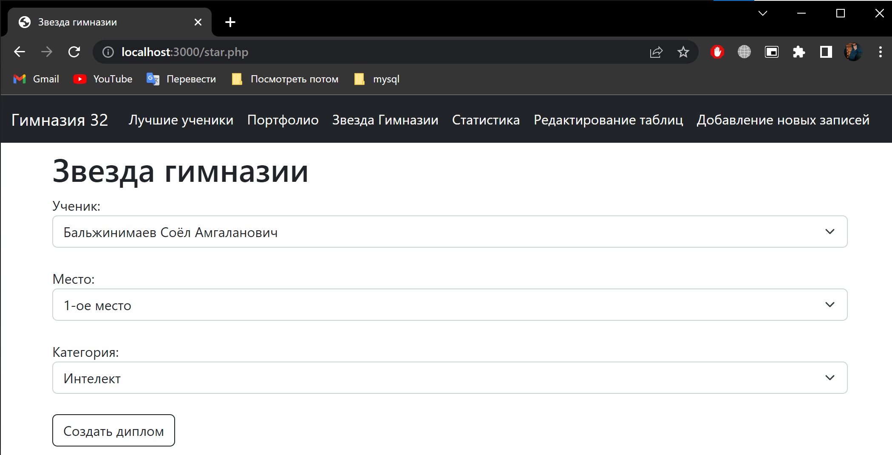
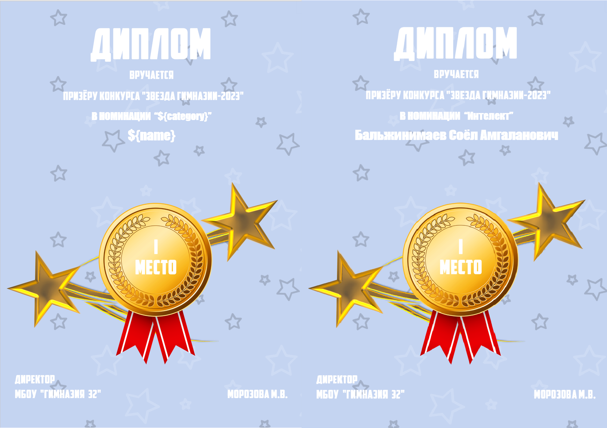

# This project is an information system for assessing extracurricular activities of school students

**Functionality:**
* Database management (reading, adding, editing and deleting records);
* Ensuring data protection from unauthorized access (authorization system);
* Automatic assessment of all student achievements;
* Display a list of students ranked by number of points;
* Providing statistics on student achievements;
* Creation and output of student portfolios;
* Creation and output of diplomas for event winners.

***

**Technology stack:**
* Programming languages `PHP and HTML`
* DBMS `MySQL`
* `Bootstrap` framework

***

**Database**

ER – database diagram

There is a database dump in the repository

***
# Examples of project pages

**Top Students Page**

**Portfolio Page**

To create a portfolio, the PhpWord library is used.
Example of a template and final portfolio:

**Gymnasium Star Page**

Example of a template and final diploma:

## Example of working with the site

***
This project is my graduation work at the university. You can find out more about it at the link:
https://elibrary.nstu.ru/source?id=181227
